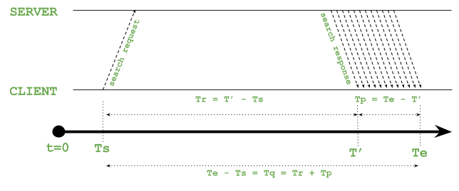
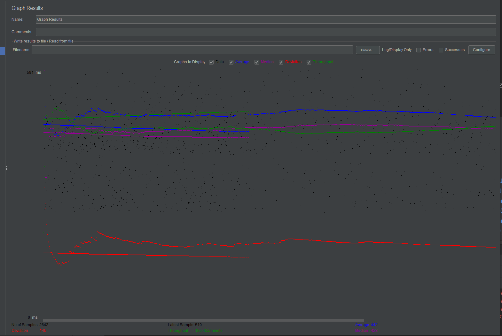
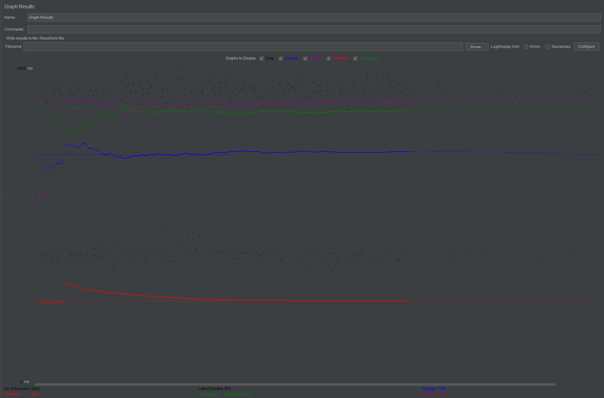
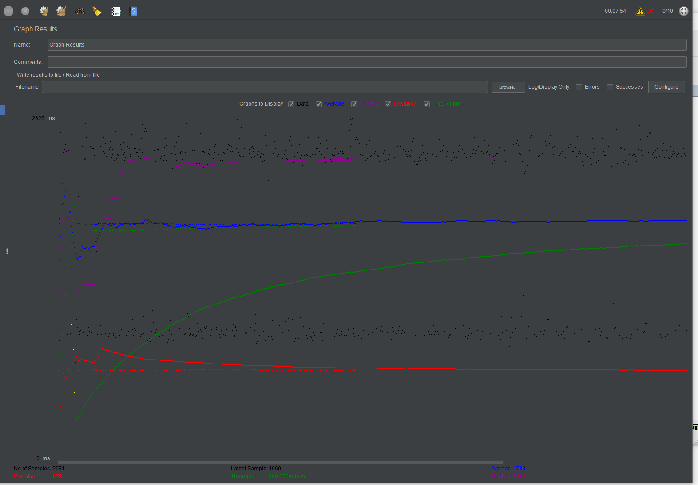
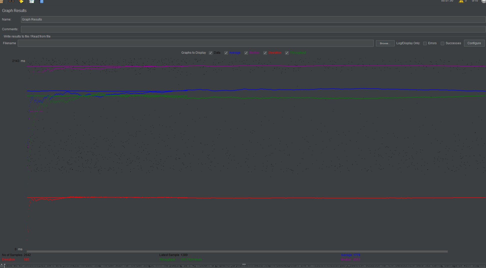
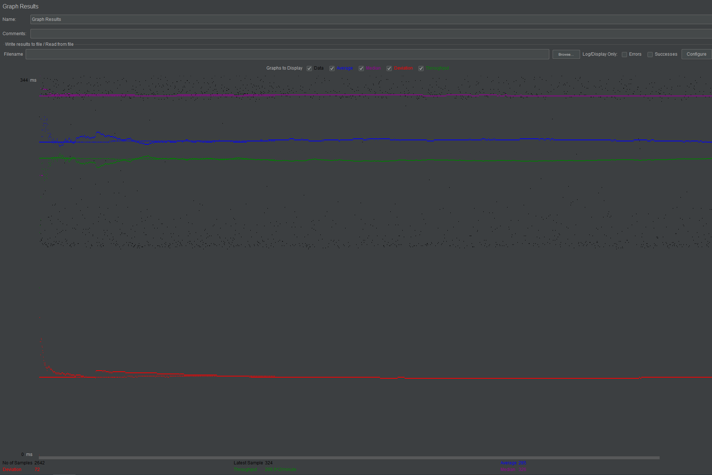
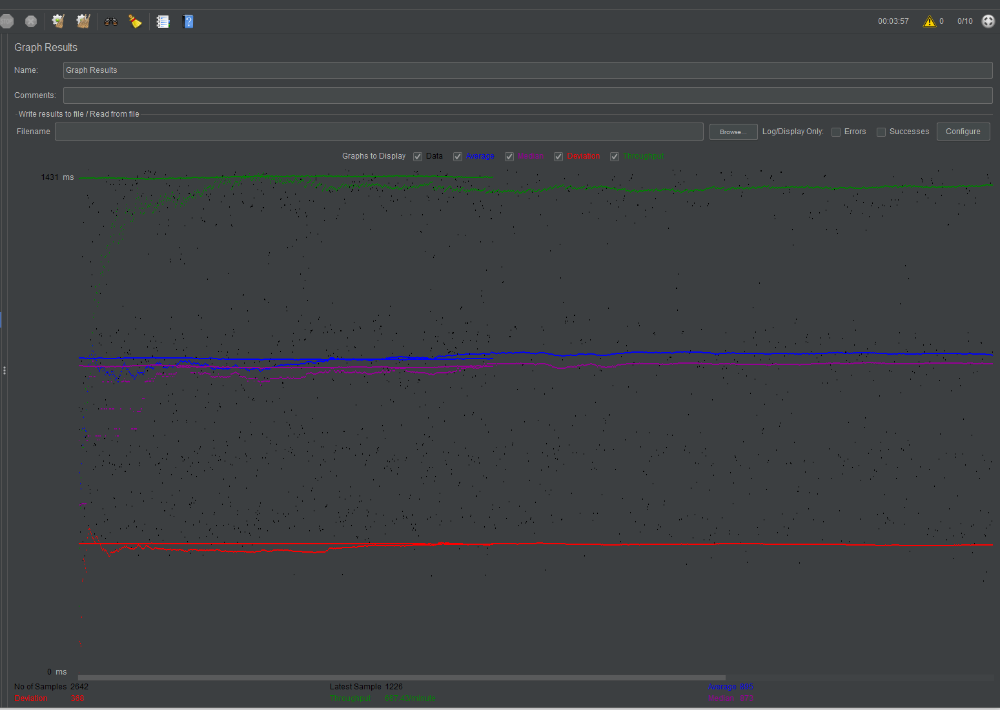
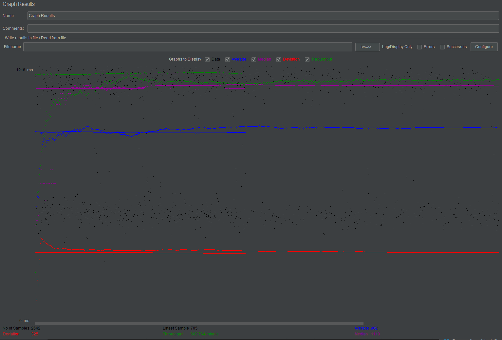

- # Movie Database Fabflix
    - #### General Introduction:
          
        Fabflix is a web-based movie database which is developed with AWS, MySQL, Tomcat HTML5, jQuery Java and JavaScript. It also has an Android app as a frontend. Fabflix supports Full Text Search, Autocomplete, Automatic Error Correction, XML parsing and all basic features that a movie search site should have. The search latency is less than 200 milliseconds.
    
        - ##### Demo 1 - Basic functions (Movie List Page, Single Movie Page, Single Star Page): https://youtu.be/zs9H49_pt4c
        - ##### Demo 2 - More functions (Login Page, Main page, Shopping cart): https://youtu.be/o4I_-lf-swA
        - ##### Demo 3 - reCAPTCHA, HTTPS, PreparedStatement, Stored Procedure, XML Parsing: https://youtu.be/fCWp3MFBO4s
        - ##### Demo 4 - Full Text Search, Autocomplete, Android Application, Fuzzy Search: https://youtu.be/EWjNIo9HVOI
        - ##### Demo 5 - Scaling Fabflix and Performance Tuning: https://youtu.be/QgeYzN3phlk

     - #### Folder Introduction:
        android: Android app, also the frontend for Fablix.
        encrypt: The encryptor which updates the plain text password to encrypted password and store it in the database.
        parser: The parser which imports large XML data files into the Fabflix database
        webapp: Fablix website.
        webapp-scaled: Fablix website - scaled version.

    - #### Instruction of deployment:
    1. First clone whole project from github use command line or use git (local machine).
    2. Use Maven create war package (at where xml file locate).
    3. Copy war file to correct location (tomcat webapps). On local machine need to specify where it is by using IntelliJ.
    4. Show tomcat web apps by using http://<AWS public IP>:8080/manager/html or command line. On local machine just run it through IntelliJ.
    

- # JMeter TS/TJ Time Logs
    - #### Instructions of how to use the `log_processing.*` script to process the JMeter logs.
        I wrote the log_processing using JAVA, it will parse the time_used.txt (should locate at the root of project folder) and calculate Total/Average TJ and TS.

- # JMeter TS/TJ Time Measurement Report
       

| **Single-instance Version Test Plan**          | **Graph Results Screenshot** | **Average Query Time(ms)** | **Average Search Servlet Time(ms)** | **Average JDBC Time(ms)** | **Analysis** |
|------------------------------------------------|------------------------------|----------------------------|-------------------------------------|---------------------------|--------------|
| Case 1: HTTP/1 thread                          |              | 442                        | 175.3                               | 176.03                    | Connection is not stable in the beginning, but after few minutes, it became stable. The average time cost is low since we only have 1 thread.           |
| Case 2: HTTP/10 threads                        |              | 1799                       | 1586.3                              | 1586.0                    | Graph looks pretty stable, average time cost is long           |
| Case 3: HTTPS/10 threads                       |              | 1789                       | 1682.2                              | 1681.8                    | Graph is not stable at all, I guess the reason is re-direction. The average time cost is long.           |
| Case 4: HTTP/10 threads/No connection pooling  |              | 1778                       | 1564.4                              | 1564.0                    | Graph looks pretty stable, average time cost is long. Even I did not enable pooling, the time cost seems not that different.           |

| **Scaled Version Test Plan**                   | **Graph Results Screenshot** | **Average Query Time(ms)** | **Average Search Servlet Time(ms)** | **Average JDBC Time(ms)** | **Analysis** |
|------------------------------------------------|------------------------------|----------------------------|-------------------------------------|---------------------------|--------------|
| Case 1: HTTP/1 thread                          |              | 285                        | 173.3                               | 172.6                     | Graph looks pretty stable, average time cost is low, I guess the reason is there are 2 instance and pooling is enabled.           |
| Case 2: HTTP/10 threads                        |              | 895                        | 759.6                               | 759.2                     | Connection is not stable in the beginning, but after few seconds, it became stable. The average time cost is longer than above because we have 10 threads, but much shorter than single-version.          |
| Case 3: HTTP/10 threads/No connection pooling  |              | 902                        | 804.7                               | 804.0                     | With out pooling, the time cost became longer, but still shorter than single version.           |

- # Logs file
Single-instance

Case 1: https://github.com/DragonAoSky/Movie-Database-Fabflix/blob/master/logs/single_http_1_Pool_time_used.txt

Case 2: https://github.com/DragonAoSky/Movie-Database-Fabflix/tree/master/logs/single_http_10_Pool_time_used.txt

Case 3: https://github.com/DragonAoSky/Movie-Database-Fabflix/tree/master/logs/single_https_10_Pool_time_used.txt

Case 4: https://github.com/DragonAoSky/Movie-Database-Fabflix/tree/master/logs/single_http_10_noPool_time_used.txt

Scaled Version

Case 1: https://github.com/DragonAoSky/Movie-Database-Fabflix/blob/master/logs/scaled_http_1_Pool_time_used.txt

Case 2: https://github.com/DragonAoSky/Movie-Database-Fabflix/blob/master/logs/scaled_http_10_time_used.txt

Case 3: https://github.com/DragonAoSky/Movie-Database-Fabflix/blob/master/logs/scaled_http_10_noPool_time_used.txt

- # Filters and https
For testing purpose, I disabled filters for both webapp and webapp-scaled, comment out HTTPSonly for webapp-scaled.